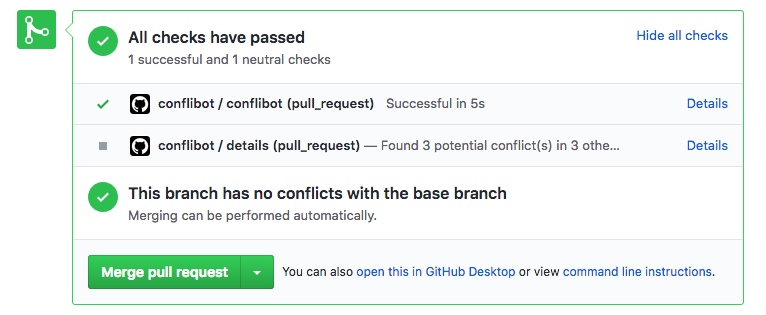
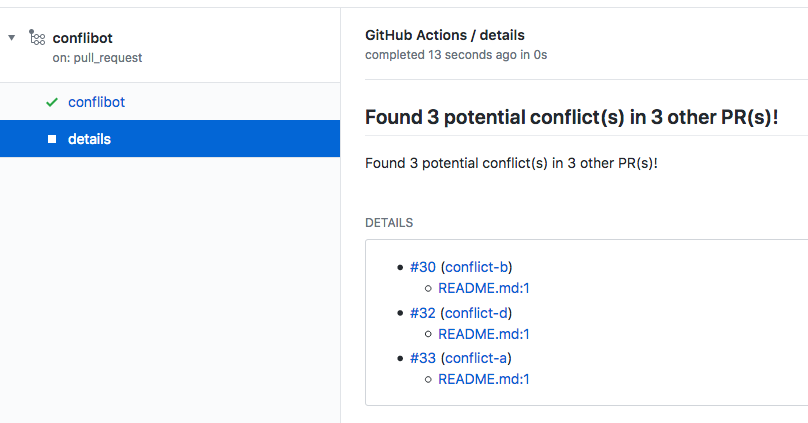

# conflibot

Check and warn if a Pull Request will conflict with another Pull Request when they get merged.

## Configuration

```yaml
name: conflibot
on: pull_request_target

jobs:
  conflibot:
    runs-on: ubuntu-latest
    steps:
      - uses: actions/checkout@v3
      - name: Warn potential conflicts
        uses: wktk/conflibot@v1
        with:
          github-token: ${{ secrets.GITHUB_TOKEN }}
          exclude: |
            yarn.lock
            **/*.bin
```

### Inputs

- `github-token` *required*: GitHub API token with write access to the repo
- `exclude`: Ignored path patterns in **newline-separated** glob format

## Screenshots




## Privacy

This Action contacts Chainguard's licensing server to verify authorization. Connection metadata (IP address, GitHub repository identifier, timestamp, and any metadata encoded in the auth token) is transmitted to Chainguard, Inc. even if authorization is denied in accordance with our [Privacy Notice](https://www.chainguard.dev/legal/privacy-notice)
